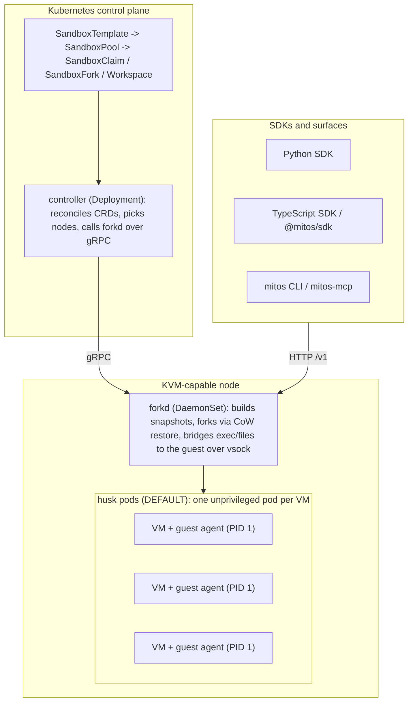

<h1 align="center">mitos</h1>

<p align="center">
  <b>Millisecond microVM sandbox forking for AI agents on Kubernetes.</b><br/>
  Isolated, forkable computers for your agents: Firecracker microVMs that restore from memory snapshots in milliseconds, fork into parallel attempts, and persist durable workspaces.
</p>

<p align="center">
  <a href="https://github.com/paperclipinc/mitos/actions/workflows/ci.yaml"></a>
  <a href="https://github.com/paperclipinc/mitos/releases"></a>
  <a href="LICENSE"></a>
  <a href="https://github.com/paperclipinc/mitos"></a>
  <a href="https://goreportcard.com/report/github.com/paperclipinc/mitos"></a>
  <a href="docs/"></a>
</p>

<p align="center">
  <a href="docs/">Documentation</a> .
  <a href="#quickstart">Quickstart</a> .
  <a href="#architecture">Architecture</a> .
  <a href="#comparison">Comparison</a> .
  <a href="CONTRIBUTING.md">Contributing</a>
</p>

---

## What is mitos

Agent harnesses need fast, isolated environments where agents can read and write files, install packages, and run untrusted code. Every existing option forces a trade you should not have to make: speed without ownership, isolation without forking, Kubernetes-nativeness without warm starts, or durability as someone else's proprietary cloud.

`mitos` is, as far as we know, the only open-source, self-hostable, Kubernetes-native runtime whose engine does N-way live copy-on-write fork of a running microVM, and it does so with a **warm-claim activate in the tens-of-ms class**: P50 ~27 ms on the bare-metal reference node, reproducible from [`bench/husk-activate-latency.sh`](bench/husk-activate-latency.sh). You drive the whole lifecycle through declarative CRDs (`mitos.run`) on your own cluster, or fully hosted by us.

Two ways to run it:

- **Self-hosted**: any Kubernetes cluster with KVM nodes. Your data never leaves your infrastructure. Bare metal (Hetzner + Talos is the reference platform) is a first-class target.
- **Hosted**: a managed service operated by us, same engine and same API, for teams that want milliseconds without managing nodes.

> Live N-way CoW fork runs on the husk pod-native default: the source husk pod snapshots its running VM and N child husk pods restore it via CoW, each an independent Ready child, verified on a real KVM cluster. The raw-forkd engine path, where forkd's in-process engine owns the running VM, also forks. Warm-claim activate, blocking exec, `run_code` fail-closed, self-heal, autoscale, live fork, and durable forkable workspaces are all verified on the husk default on a real KVM cluster.

## Quickstart

### Python

```python
from mitos import AgentRun

c = AgentRun()                                   # kubeconfig or in-cluster; autodetected

# One-liner: a lazy default pool is created for the image if you have none.
sb = c.sandbox("python", ready=True)             # claims a warm sandbox, waits Ready
result = sb.exec("python -c 'import numpy as np; print(np.mean([1,2,3,4,5]))'")
print(result.stdout)                             # 3.0

# Fork the running sandbox to try two approaches against shared warmed state.
# Live fork runs on the husk pod-native default and the raw-forkd engine path;
# each child is an independent Ready sandbox.
fork_a, fork_b = sb.fork(2)
fork_a.exec("python -c \"open('/workspace/plan_a.txt','w').write('conservative')\"")
fork_b.exec("python -c \"open('/workspace/plan_b.txt','w').write('aggressive')\"")

sb.terminate()
```

`c.sandbox("python")` lazily creates a default pool `mitos-default-python` (a SandboxTemplate plus a SandboxPool) if you have none; pass `pool="my-pool"` to use an existing pool, which never creates anything. Errors raise `AgentRunError(code, cause, remediation)`.

The async client (`AsyncAgentRun`) mirrors the hot paths and adds `create_pty()` for an interactive terminal over WebSocket.

### TypeScript

```typescript
import { AgentRun } from "@mitos/sdk";

const run = new AgentRun();                       // direct or cluster mode

const sb = await run.sandbox("python", { ready: true });
const result = await sb.exec("python -c 'print(40 + 2)'");
console.log(result.stdout);                        // 42

const reconnected = await run.fromName(sb.name);   // durable reconnect handle
await sb.terminate();
```

The TypeScript SDK (`@mitos/sdk`) exposes the same one-liner `sandbox(image)`, `fromName` reconnect, streaming exec, and a server-envelope-aware `AgentRunError`. Parity table in [sdk/typescript/README.md](sdk/typescript/README.md).

### CLI

```bash
go build -o mitos ./cmd/mitos/

mitos sandbox create --pool dev-default
mitos run echo hello --pool dev-default
mitos sandbox ls
```

`mitos dev up` brings up a one-command local control plane on a mock engine. An MCP server (`mitos-mcp`) exposes sandboxes as MCP tools so any MCP-speaking agent can use them with zero SDK integration. See [docs/cli.md](docs/cli.md) and [docs/mcp.md](docs/mcp.md).

### Beyond exec

```python
# Streaming exec: callbacks fire per chunk; the ExecResult still carries the aggregate.
sb.exec("pip install rich", on_stdout=lambda b: print(b.decode(), end=""))

# Stateful code interpreter: state persists across run_code calls for the sandbox lifetime.
ex = sb.run_code("import pandas as pd; df = pd.DataFrame({'x':[1,2,3]}); df.describe()")
print(ex.text)            # the REPL's last value, rendered
for r in ex.results:      # rich multi-MIME display artifacts (tables, images, ...)
    print(r.mime)
# run_code returns a KernelUnavailable error until the kernel ships in the husk base image.

# Detach a long-running process and keep working.
sb.exec_background("python train.py > /workspace/train.log 2>&1")
```

Streaming exec (`/v1/exec/stream`) and the interactive PTY (`/v1/pty`) require the raw-forkd path or a husk template snapshot rebuilt with the current guest agent: the agent baked into today's husk template snapshot predates the vsock streaming/PTY frame protocol, so on the husk default the stream and the PTY WebSocket close early. Blocking exec (`/v1/exec`) is unaffected and works on the husk default. The husk template guest-agent rebuild is a tracked follow-up ([#24](https://github.com/paperclipinc/mitos/issues/24)).

### On a cluster

```bash
kubectl apply -k deploy/
```

The self-contained kustomize base installs the CRDs, the controller in the default husk mode, the forkd builder DaemonSet, the `/dev/kvm` device plugin, and the PKI bootstrap, and applies on a real KVM node with no manual patches. Nodes need `/dev/kvm` and the label `mitos.run/kvm=true`; the controller discovers forkd pods automatically. A Helm chart is planned ([#37](https://github.com/paperclipinc/mitos/issues/37)).

```yaml
apiVersion: mitos.run/v1alpha1
kind: SandboxTemplate
metadata:
  name: python-agent
spec:
  image: python:3.12-slim
  init:
    - "pip install numpy pandas requests"
  resources:
    cpu: "1"
    memory: "512Mi"
  volumes:
    - name: workspace
      size: 5Gi
      forkPolicy: Snapshot
---
apiVersion: mitos.run/v1alpha1
kind: SandboxPool
metadata:
  name: python-agent-pool
spec:
  templateRef:
    name: python-agent
  replicas: 10
---
apiVersion: mitos.run/v1alpha1
kind: SandboxClaim
metadata:
  name: agent-session-1
spec:
  poolRef:
    name: python-agent-pool
  secrets:
    - name: anthropic-key
      secretRef:
        name: agent-secrets
        key: ANTHROPIC_API_KEY
---
apiVersion: mitos.run/v1alpha1
kind: SandboxFork
metadata:
  name: parallel-attempt
spec:
  sourceRef:
    name: agent-session-1
  replicas: 3
  allowSecretInheritance: true   # forks duplicate memory; opt in knowingly
```

## Features

Each row is honest about where it runs. The husk pod-native path is the DEFAULT; items that run on the raw-forkd engine path but are not yet wired on the husk default are marked.

### Speed

| Capability | What you get | Docs |
|---|---|---|
| Warm-claim activate | P50 ~27 ms on the bare-metal reference node (snapshot load + fork-correctness handshake + guest-ready, integrity gate enforced); ~6-16 ms snapshot restore; ~3 MiB marginal memory per forked sandbox via CoW page sharing | [BENCHMARKS.md](BENCHMARKS.md) |
| Pre-snapshotted pools | OCI images flattened to ext4 rootfs and warmed with your `init` steps before snapshotting, so there is no cold start on claim | [docs/templates.md](docs/templates.md) |
| CoW memory sharing | You pay for unique pages across forks, not for copies | [docs/metering.md](docs/metering.md) |
| Content-addressed distribution | Forks pull only the missing sha256 chunks from a holder node over mTLS; rebuilds ship deltas, with a version-compatibility contract that refuses incompatible snapshots | [docs/snapshot-distribution.md](docs/snapshot-distribution.md) |

### Isolation

| Capability | What you get | Docs |
|---|---|---|
| Hardware isolation per session | A dedicated kernel per sandbox (KVM/Firecracker); the husk default runs each VM in its own unprivileged, PSA-restricted pod, which IS the per-VM boundary | [docs/threat-model.md](docs/threat-model.md) |
| Jailed fallback | Raw-forkd runs forks under the Firecracker jailer (per-VM UID, chroot, cgroup); the remaining builder capability set is documented as a threat-model residual | [docs/threat-model.md](docs/threat-model.md) |
| No silent secret inheritance | Live forks of secret-holding sandboxes are rejected unless explicitly opted in; credentials are injected at claim time over vsock, never baked into snapshots | [docs/threat-model.md](docs/threat-model.md) |
| Encryption at rest | Per-scope LUKS2 containers with crypto-shredding and KMS envelope wrapping (behind `--enable-encryption`, fail-closed); HSM-backed keys and per-workspace scope are follow-ups | [docs/encryption.md](docs/encryption.md) |
| Default-deny egress | Host-side nftables egress allowlists by literal IP:port and by name through a controlled per-node DNS resolver; the guest cannot influence enforcement (opt-in per node) | [docs/networking.md](docs/networking.md) |

### Agent DX

| Capability | What you get | Docs |
|---|---|---|
| Blocking exec | Correct stdout and exit code over the sandbox API; works on the husk default | [docs/cli.md](docs/cli.md) |
| Streaming exec and PTY | Incremental stdout/stderr, background processes, and a token-gated interactive WebSocket terminal (engine path; husk wiring tracked [#24](https://github.com/paperclipinc/mitos/issues/24)) | [#24](https://github.com/paperclipinc/mitos/issues/24) |
| Code interpreter | `run_code` with a stateful kernel and rich multi-MIME results, in both SDKs and the MCP server; fail-closed `KernelUnavailable` until the kernel ships in the husk base image | [docs/mcp.md](docs/mcp.md) |
| LLM-legible errors | Every failure carries `{code, cause, remediation}`, parsed by both SDKs into a structured `AgentRunError` | [#28](https://github.com/paperclipinc/mitos/issues/28) |
| SDKs and surfaces | Python and TypeScript SDKs with a one-liner `sandbox(image)`, lazy default pool, `from_name` reconnect, and async Python client; plus the `mitos` CLI and an MCP server | [docs/cli.md](docs/cli.md) |

### Kubernetes-native

| Capability | What you get | Docs |
|---|---|---|
| Declarative CRDs | `SandboxTemplate`, `SandboxPool`, `SandboxClaim`, `SandboxFork` with volume topology and fork behavior | [docs/templates.md](docs/templates.md) |
| Pod-native execution (DEFAULT) | Each per-sandbox VM runs in an unprivileged pod (`/dev/kvm` from a device plugin, not `privileged`), so CPU/memory requests are scheduler truth and PSA governs the pod | [docs/threat-model.md](docs/threat-model.md) |
| Capacity-aware scheduling | CoW bin-packing onto warm holders, an overcommit budget on CoW-aware accounting, a `MaxSandboxes` host-DoS ceiling with atomic slot reservation, and typed `NoCapacity` backpressure instead of OOMing a node | [docs/scheduling.md](docs/scheduling.md) |
| Demand-driven autoscaling | `SandboxPool.spec.autoscale` scales the dormant husk-pod count to `clamp(inUse + targetSpare, minWarm, maxWarm)` with an anti-thrash cooldown; a fixed pool is just `minWarm == replicas` | [docs/scheduling.md](docs/scheduling.md) |
| Failure and GC semantics | Claim TTLs, orphan-VM sweeps, controller-restart reconciliation, forkd crash reaping via an on-disk journal, node-loss handling, and saturation backpressure, implemented and CI-proven | [docs/failure-gc.md](docs/failure-gc.md) |

### Durable state

| Capability | What you get | Docs |
|---|---|---|
| Durable forkable workspaces | `Workspace`/`WorkspaceRevision` CRDs: durable, versioned, forkable agent state independent of any sandbox; `/workspace` hydrates on start and a committed revision dehydrates on terminate over the content-addressed store. Verified end to end on a real KVM cluster: create -> commit -> fork, where the forked sandbox reads the committed state | [docs/workspaces.md](docs/workspaces.md) |
| Outputs and diff | A claim `spec.outputs` narrows the dehydrate to listed subtrees; a `{diff: true}` output records a content-hash diff against the parent head | [docs/workspaces.md](docs/workspaces.md) |
| Git rendezvous | A `{git}` output pushes per-attempt branches to a rendezvous remote (git is the merge layer; the engine pushes, a human/CI merges). On the husk path the push is currently best-effort; fully wiring it is tracked | [#21](https://github.com/paperclipinc/mitos/issues/21) |

### Operable

| Capability | What you get | Docs |
|---|---|---|
| Metrics and tracing | Node and controller Prometheus metrics, a per-claim OpenTelemetry trace (`--otlp-endpoint`), and a toggleable structured audit log (`--audit-log`) recording command/path and byte counts, never content or secrets | [docs/observability.md](docs/observability.md) |
| CoW-aware metering | The shared template page set is counted once, not once per fork, so billing and scheduling reflect the honest physical footprint | [docs/metering.md](docs/metering.md) |
| Operator tooling | `kubectl sandbox` plugin (`ls` / `ps`) and the operational `GET /v1/metering` report | [docs/observability.md](docs/observability.md) |
| Bare metal first-class | Talos + Hetzner is the reference platform | [docs/platforms/talos-hetzner.md](docs/platforms/talos-hetzner.md) |

## Architecture



Data paths:

- **Claim path**: the controller selects a node, calls forkd `Fork` over gRPC; the claim status endpoint is forkd's HTTP API on that node.
- **Exec path**: SDK -> forkd HTTP API -> vsock -> guest agent (PID 1 inside the VM).

Sandboxes are not pods. Pod-scoped Kubernetes mechanisms (NetworkPolicy, ResourceQuota, PSA) govern the husk pod, not the workload inside the microVM; where we provide an equivalent, it is documented as ours. The sandbox is the VM, not the husk pod.

## Local development (no KVM required)

One command brings up a local kind cluster running a mock control plane, then the `mitos` CLI drives the full claim path:

```bash
go build -o mitos ./cmd/mitos/

docker build -f Dockerfile.controller -t mitos-controller:ci .
docker build -f Dockerfile.forkd -t mitos-forkd:ci .
kind create cluster --name mitos-dev --config hack/kind-config.yaml
kind load docker-image mitos-controller:ci --name mitos-dev
kind load docker-image mitos-forkd:ci --name mitos-dev

./mitos dev up --skip-cluster-create
./mitos sandbox create --pool dev-default   # reaches Ready on the mock engine
./mitos sandbox ls
./mitos run echo hello --pool dev-default
./mitos dev down
```

The local dev cluster uses the mock fork engine (no KVM): claims reconcile to `Ready` and control-plane dispatch works, but a real in-VM `exec` needs a node with `/dev/kvm`. For the no-cluster REST loop, run `go run ./cmd/sandbox-server --mock --addr :8080` and use the Python SDK (`sdk/python`). See [docs/cli.md](docs/cli.md).

## Comparison

A numbers table belongs here only when our benchmark harness can regenerate it against the actual competitors on the same hardware, with scripts in this repo so anyone can reproduce or refute it. That harness is [#15](https://github.com/paperclipinc/mitos/issues/15). The differentiator is not a single fastest-number claim: `mitos` is, as far as we know, the only open-source, self-hostable, Kubernetes-native runtime whose engine does N-way live copy-on-write fork of a running microVM, with a warm-claim activate in the tens-of-ms class (P50 ~27 ms, reproducible from [`bench/husk-activate-latency.sh`](bench/husk-activate-latency.sh)).

The figures below are **other vendors' published numbers, for different operations, on different hardware, measured with different methodology**; they are NOT measured by us and this is NOT a head-to-head claim. The matched-hardware comparison is [#15](https://github.com/paperclipinc/mitos/issues/15).

| Runtime | Published figure (theirs, not ours) | Operation they describe |
|---|---|---|
| mitos (ours, measured) | ~27 ms P50 | warm-claim activate (snapshot load + fork-correctness handshake + guest-ready) on the bare-metal reference node |
| E2B | ~150 ms | sandbox create |
| Daytona | sub-90 ms | create from snapshot |
| Modal | sub-second | sandbox create |
| CodeSandbox SDK | ~863 ms / ~495 ms | live fork / memory-resume |
| Fly Machines | < 1 s | machine start |

What is comparable and real today is the qualitative pareto map: the combination of open source, self-hostable, k8s-native, and live snapshot fork is the axis where `mitos` is alone.

| | mitos | E2B | Modal | Daytona | Morph | Cloudflare | Box | Agent Sandbox | Kata/KubeVirt | raw Firecracker |
|---|---|---|---|---|---|---|---|---|---|---|
| Hardware isolation per session | KVM microVM | microVM | gVisor | container/VM | microVM | V8 isolate | VM | Kata option | KVM | KVM |
| Snapshot fork of running state | yes, core primitive | snapshot/resume | memory snapshots | no | yes (Infinibranch) | no | disk fork | no | no | build it yourself |
| Warm-pool millisecond claims | yes (design center) | warm pools | warm pools | workspaces | yes | instant isolates | not published | 1-3s cold | seconds | build it yourself |
| Durable forkable workspaces | Workspace CRD | no | volumes | workspaces | yes, proprietary | yes (disk) | no | PVCs | PVCs | no |
| Kubernetes-native API | CRDs | SaaS API | SaaS API | SaaS/OSS | SaaS API | SaaS API | agent-native CLI | CRDs | CRDs | no |
| Self-hostable | yes, any KVM cluster | partial OSS | no | OSS core | no | no | no | yes | yes | yes |
| Hosted option | planned (same engine) | yes | yes | yes | yes | yes | yes (only) | no | no | no |
| Your data stays on your infra | yes (self-hosted) | no | no | partial | no | no | no | yes | yes | yes |
| Open source | Apache 2.0 | partial | no | partial | no | no | no | Apache 2.0 | Apache 2.0 | Apache 2.0 |

SaaS runtimes (E2B, Modal, Daytona, Cloudflare) are fast but your agents' code, data, and credentials run on someone else's infrastructure with no self-host path at equivalent capability. Morph built the right state model (branch/restore) as a proprietary cloud, and our Workspace primitive targets the same semantics open source at fork(2) speeds. Box is a hosted-only disk-fork sandbox SaaS with an agent-native CLI, which validates the agent-native direction we take with `mitos` and MCP (Box publishes no latency benchmark, so we make no comparison claim there). Agent Sandbox (k8s-sigs) is winning the Kubernetes API standard without a snapshot-fork engine, which is why we ship a conformance facade (`cmd/facade`) to be its fastest backend rather than fighting it ([docs/facade-conformance.md](docs/facade-conformance.md)). Kata, KubeVirt, and raw Firecracker give you the isolation primitive and leave the pool, fork, distribution, and agent-API layers as your problem.

If an alternative beats us on an axis you care about and we have no roadmap line that closes it, that is a bug in our strategy: open an issue.

## Project status

Early development, pre-1.0 (released `0.2.0`; `v0.3.0` is being cut now). Do not run untrusted code with this project in production yet, and note that there has been no external security review ([docs/threat-model.md](docs/threat-model.md)). The control plane is real end-to-end (claim to running sandbox, proven in CI against mock engines and real Firecracker VMs, and exercised on a bare-metal Talos KVM cluster).

**Husk-default scope, verified on a real KVM cluster:** warm-claim activate, blocking exec (`/v1/exec` with correct stdout and exit code), `run_code` failing closed with a clean `KernelUnavailable` (the husk base image lacks the kernel), self-heal / re-pend, pool warming plus demand autoscaling, live `SandboxFork` (the source husk pod snapshots its running VM and N child husk pods restore it via CoW, each an independent Ready child), and durable forkable workspaces (create -> commit -> fork where the forked sandbox reads the committed state, hydrate/dehydrate of `/workspace` over the content-addressed store) all work end to end on the husk default.

**Tracked tails not yet fully on the husk default:** streaming exec and the interactive PTY (the guest agent baked into the husk template snapshot predates the vsock streaming/PTY frame protocol and needs a template rebuild, [#24](https://github.com/paperclipinc/mitos/issues/24)); live-VM memory snapshot hooks for resumable workspace heads (gated behind `--workspace-memory-snapshots`, fail-loud); S3/encryption live store-selection (the live transport defaults to the node content-addressed store); the husk `{git}` workspace push (best-effort on husk today, [#21](https://github.com/paperclipinc/mitos/issues/21)); and multi-node N>1 (designed, single-node-verified, [#3](https://github.com/paperclipinc/mitos/issues/3)).

[ROADMAP.md](ROADMAP.md) is the single source for what is done, in progress, and gated; the operating rule is that this repository never describes a system that does not exist.

## Documentation

Per-topic docs in [`docs/`](docs/):

| Topic | Doc |
|---|---|
| Templates and OCI image to rootfs build | [docs/templates.md](docs/templates.md) |
| Volume fork policies | [docs/volumes.md](docs/volumes.md) |
| Snapshot format and version-compatibility | [docs/snapshot-format.md](docs/snapshot-format.md) |
| Snapshot distribution (content-addressed transfer) | [docs/snapshot-distribution.md](docs/snapshot-distribution.md) |
| Guest networking and egress | [docs/networking.md](docs/networking.md) |
| Encryption at rest and crypto-shredding | [docs/encryption.md](docs/encryption.md) |
| CoW-aware metering | [docs/metering.md](docs/metering.md) |
| Density and scheduling | [docs/scheduling.md](docs/scheduling.md) |
| Observability (traces, metrics, audit, plugin) | [docs/observability.md](docs/observability.md) |
| Failure and GC semantics | [docs/failure-gc.md](docs/failure-gc.md) |
| Fork-engine correctness | [docs/fork-correctness.md](docs/fork-correctness.md) |
| Durable workspaces | [docs/workspaces.md](docs/workspaces.md) |
| Threat model | [docs/threat-model.md](docs/threat-model.md) |
| `mitos` CLI | [docs/cli.md](docs/cli.md) |
| MCP server | [docs/mcp.md](docs/mcp.md) |
| Talos + Hetzner reference platform | [docs/platforms/talos-hetzner.md](docs/platforms/talos-hetzner.md) |
| Target API surface (v2 spec) | [docs/api/v2-spec.md](docs/api/v2-spec.md) |
| Benchmark methodology | [BENCHMARKS.md](BENCHMARKS.md) |

## Contributing

Contributions welcome. See [CONTRIBUTING.md](CONTRIBUTING.md) and [CLAUDE.md](CLAUDE.md) for conventions, and the [issues page](https://github.com/paperclipinc/mitos/issues) for the work tracked against [ROADMAP.md](ROADMAP.md).

## Security

The threat model with per-boundary status lives in [docs/threat-model.md](docs/threat-model.md); no external security review has happened yet, and the document says exactly what is open. To report a vulnerability, see [SECURITY.md](SECURITY.md).

## License

[Apache 2.0](LICENSE).
